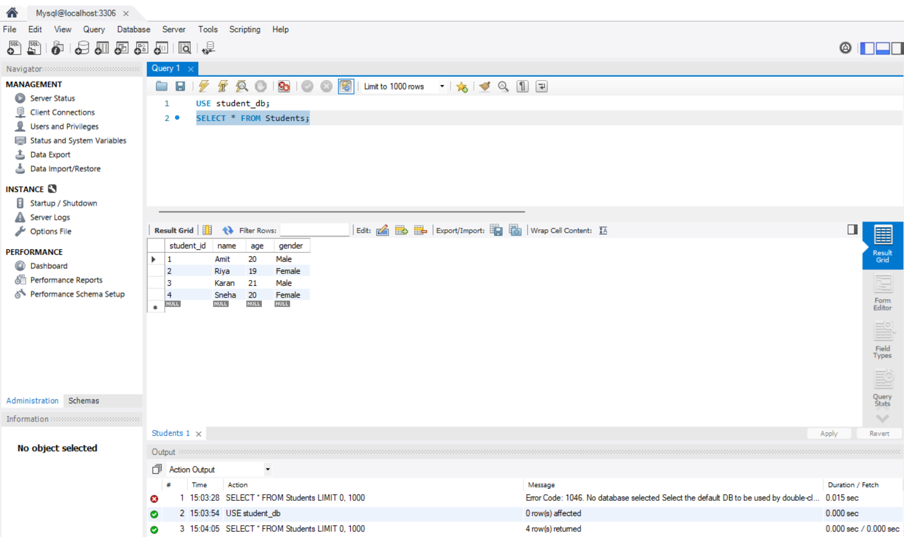
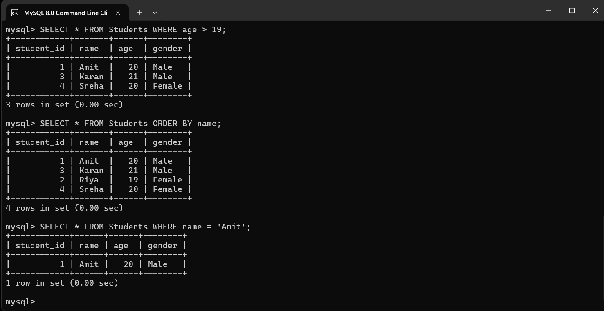
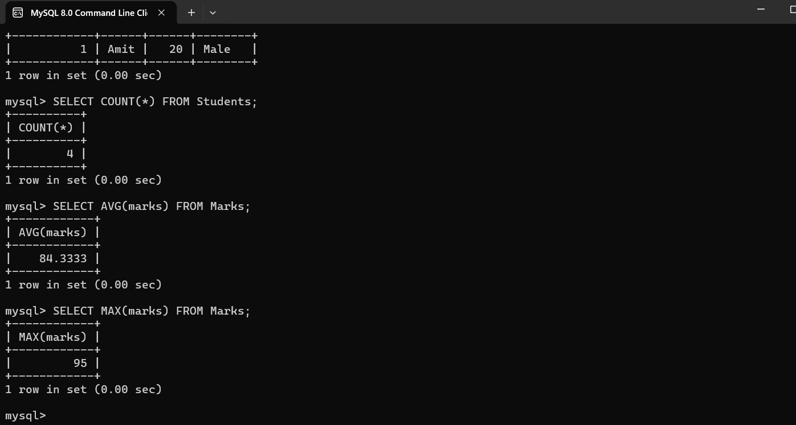
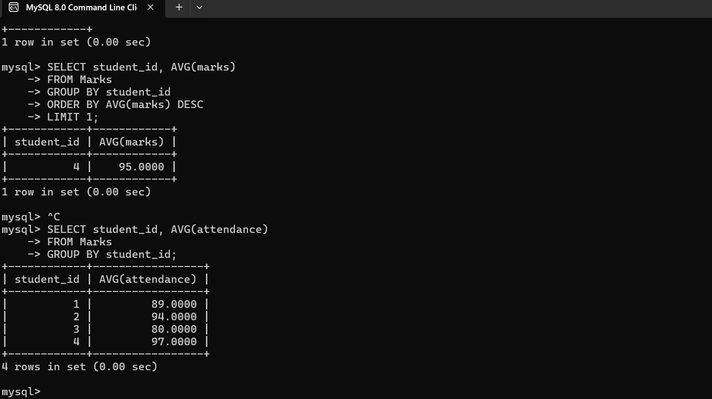
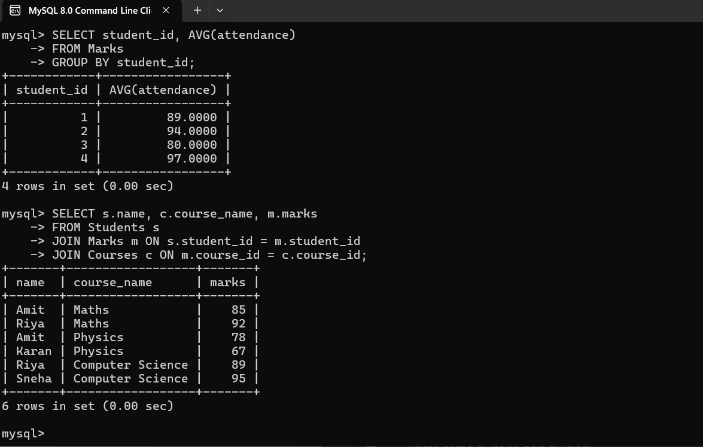

# Student Database Analysis

## Overview

This project involves creating a student database and performing SQL operations such as filtering, sorting, aggregation, and joins.

## Database Structure

* Students table
* Courses table
* Marks table

## Tasks Performed

* Created database and tables
* Inserted sample data
* Performed filtering, sorting, and searching
* Used aggregate functions (COUNT, AVG, MAX)
* Generated reports for top students and attendance
* Applied JOIN operations

## Screenshots

### Students Data

### Filtering

### Aggregate Function

### Top Student

### Join Query

## Conclusion

This project demonstrates SQL usage for data management and analysis.

